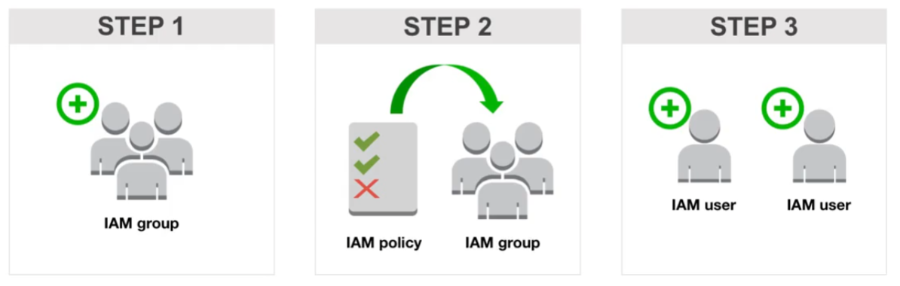
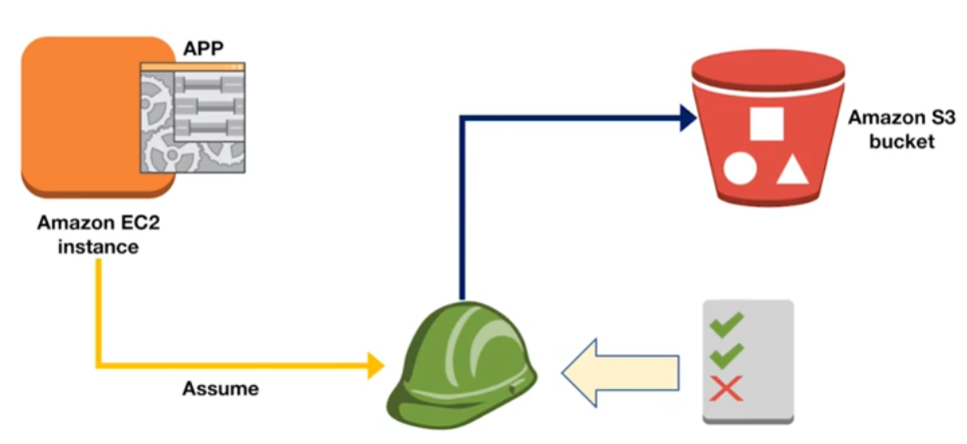

**IAM(Identity and Access Management)** \
AWS 리소스에 대한 액세스를 안전하게 제어할 수 있는 웹 서비스
{:.success}

---
<!--more-->

1. AWS **사용자 및 그룹**과 AWS 서비스에 대한 **사용자 권한**을 생성하고 관리
2. AWS 외부의 사용자도 지원 (Microsoft Active Directory, Facebook, Google 등에서 인증된 사용자에게 IAM 역할을 부여)
3. AWS 서비스 접근을 위한 2단계 인증
    1. IAM 사용자 인증
    2. AWS 서비스 권한(정책) 인증
4. IAM Policy
    ```
    "Sid": "Stmt1505076701000",             # who/what is authorized
    "Effect": "Allow",
    "Action": [
        "s3:DeleteObject",
        "s3:GetObject"
    ],
    "Condition": {
        "IpAddress": {
            "aws:SourceIP": "10.14.8.0/24
        }
    },
    "Resource": [
        "arn:aws:s3:::billing-marketing",
        "arn:aws:s3:::billing-sales",

    ]
    ```
5. **그룹**을 통해 사용자를 관리하는 것을 적극적으로 권장
6. Usecase \
[^1]
    1. 각 부서에 해당하는 IAM 그룹을 생성
    2. 정책을 생성하여 그룹에 할당
    3. 각 개인과 각 부서별로 IAM 사용자를 생성하여 해당 그룹에 추가
7. [공식적으로](https://docs.aws.amazon.com/ko_kr/IAM/latest/UserGuide/introduction.html) 일상적인 태스크에 **루트 사용자**를 사용하지 않는 것을 권장


## IAM role
**IAM Role** \
AWS에서 수행할 수 있는 작업과 수행할 수 없는 작업을 결정하는 권한이 부여된 AWS 자격 증명
{:.success}

1. 일반적으로 AWS 리소스에 대한 액세스 권한이 없는 사용자, 애플리케이션, 서비스에 액세스 권한을 위임하는 데 사용
2. Role이 임시로 부여된 사용자는 원래 자신의 권한을 포기하는 대신, Role의 사용 권한을 부여받음
3. Usecase1 (EC2 application) \

    1. IAM Role을 사용하여 **임시 보안 자격 증명**을 인스턴스 프로파일의 일부로 전달
    2. 이를 사용하여 인스턴스가 S3에 액세스
4. Usecase2
    1. 일반적으로 할당되지 않는 권한을 **임시**로 제공


### References
1. [Introduction to AWS Identity and Access Management (IAM)](https://explore.skillbuilder.aws/learn/course/internal/view/elearning/120/introduction-to-aws-identity-and-access-management-iam)
2. [AWS IAM 서비스](https://velog.io/@rokwon_k/AWS-IAM-%EC%84%9C%EB%B9%84%EC%8A%A4)
    
---

[^1]: [Introduction to AWS Identity and Access Management (IAM)](https://explore.skillbuilder.aws/learn/course/internal/view/elearning/120/introduction-to-aws-identity-and-access-management-iam)