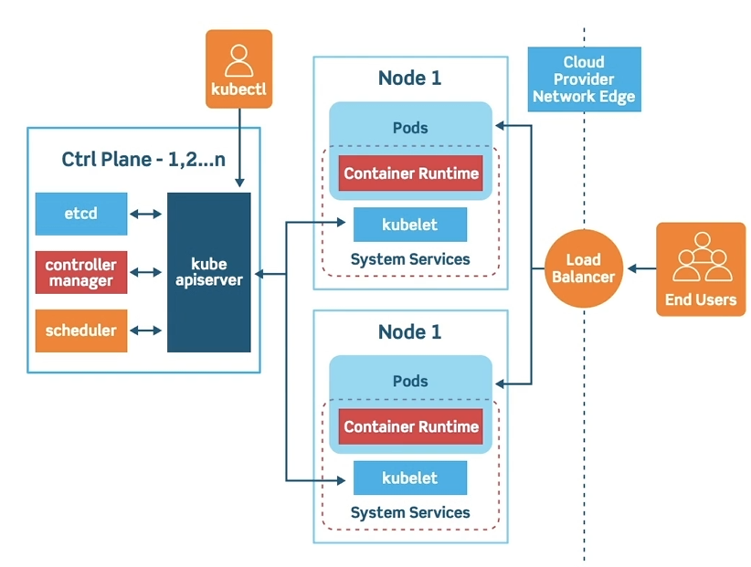
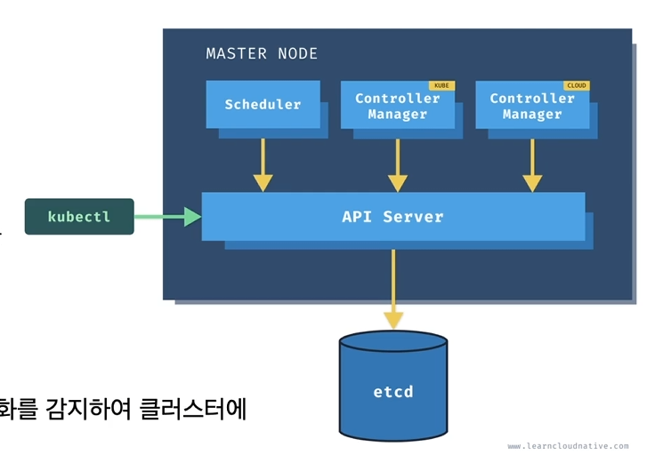
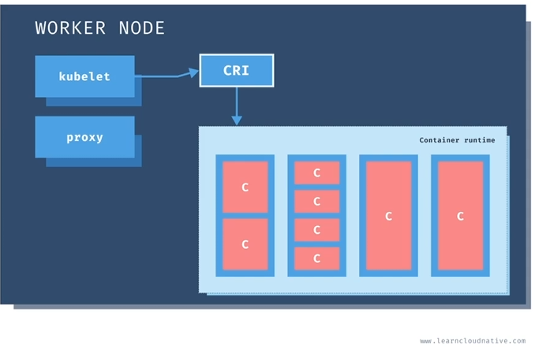
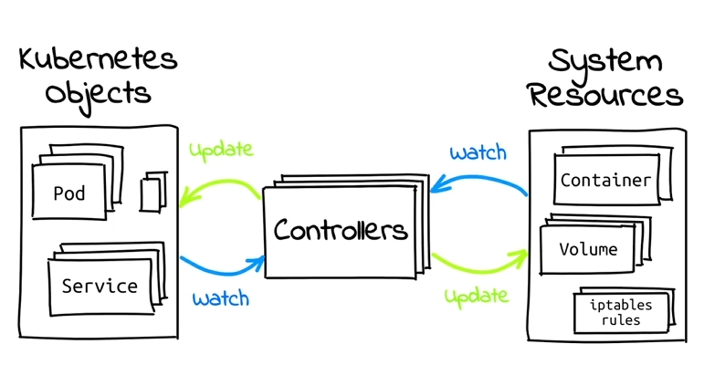

<!--more-->

# 쿠버네티스
구글 내부의 배포시스템 borg을 재작성하여 2014년 오픈소스로 공개
- 가장 대표적인 컨테이너 오케스트레이션 시스템이자 사실상 표준(De Facto Standard)

## 컨테이너 오케스트레이션 시스템
클러스터 상에서 컨테이너를 효율적으로 관리하기 위한 시스템(배포, 관리, 확장, 네트워킹을 자동화하는 기술)
- **Scheduling**, load balancing, self healing, scaling, rollback(versioning)/rollout, resource allocation(CPU, memory, GPU), service discovery(internal DNS: etcd), configuration management(configuration injection), storage orchestration, overlay network
- OS: 하나의 머신에서 프로세스를 효율적으로 관리하기 위한 프로세스 오케스트레이션 시스템
- e.g. docker swarm, k8s, MESOS, nomad(간단), RANCHER(webUI 제공)

## 왜 쿠버네티스?
1. Planet Scale
    - 수 십억 개의 컨테이너 운영 원칙 유지
2. Never Outgrow
    - 다양한 요구사항을 만족할 수 있는 유연함
    - CRD를 통한 기능 확장
3. Run Anywhere
    - 온프레미스, 퍼블릭 클라우드, 하이브리드 환경에서 동작

## 주의사항
1. 복잡한 클러스터 구성
    - Managed cluster 고려
2. 방대한 학습량
3. 오버 엔지니어링 검토 필요
    - 쿠버네티스 운영 및 관리에 필요한 인력과 비용이 충분한가?

# 쿠버네티스 버전과 배포판
## 쿠버네티스의 다양한 배포판(distributions)
1. Docker + k8s
5. AKS, GKS, EKS
6. OPENSHIFT

- Local Cluster
    1. **minikube**
    2. k3s
    3. MicroK8s

## 쿠버네티스 버전 선택
- 최신 쿠버네티스 버전, EKS 버전 등 버전 트래킹 필요

# 쿠버네티스 클러스터 구성요소
## 클러스터 구성

### Control Plane (Master Node)

- 개요
    - 클러스터 관리
    - 상태 관리 및 명령어 처리
    - 1~n개 (홀수)
    - kubectl: apiserver에서 처리
1. API Server
    - k8s 리소스와 클러스터 관리를 위한 API 제공
    - etcd를 데이터 저장소로 사용
2. Scheduler
    - 노드의 자원 사용 상태를 관리
    - 새로운 워크로드를 어디에 배포할지 관리
3. Controller Manager
    - 여러 컨트롤러 프로세스를 관리
    - 각 컨트롤러는 클러스터로부터 특정 리소스 상태의 변화를 감지하여 클러스터에 반영하는 reconcile 과정을 반복 수행
    - kube CM / cloud CM 으로 구분
5. etcd
    - 분산 key-value 저장소로 클러스터 상태 저장
    - 백업/복구 대상

### Node (Worker Node)

- 개요
    - 어플리케이션 컨테이너 실행
1. kubelet
    - API 서버와 통신하며 노드의 리소스 관리
    - 컨테이너 런타임과 통신하며 컨테이너 라이프사이클 관리
2. CRI (Container Runtime Interface)
    - kubelet이 컨테이너 런타임과 통신할 때 사용되는 인터페이스
        - Docker, containerd, cri-o 등 다양한 컨테이너 런타임 지원
3. kube-proxy
    - 오버레이 네트워크 구성
    - 네트워크 프록시 및 내부 로드밸런서 역할 수행

# API 리소스

## API 리소스와 오브젝트
1. API 리소스
    - k8s가 관리할 수 있는 오브젝트의 **종류**
    - e.g. Pod, Service, ConfigMap, Secret, Node, ServiceAccount, Role
    - 오브젝트와 비교하여 클래스(명세)로 생각해볼 수 있음
2. 오브젝트 (Object)
    - API 리소스를 인스턴스화 한 것
    - e.g. grafana pod, nginx pod
3. 관련 kubectl 명령어
    - k8s 클러스터가 지원하는 API 리소스 목록 출력 \
        `$ kubectl api-resources`
    - 특정 API 리소스에 대해 간단한 설명 확인 \
        `$ kubectl explain pod`

## 매니페스트 파일
k8s는 오브젝트를 yaml 기반 매니페스트 파일로 관리
- 주요 루트키
    - apiVersion: 오브젝트가 어떤 API 그룹에 속하고 API 버전이 몇인가?
    - kind: 오브젝트가 어떤 API 리소스인가?
    - metadata: 오브젝트를 식별하기 위한 정보(이름, 네임스페이스, 레이블 등)?
    - spec: 오브젝트가 가지고자 하는 데이터는?
        - API 리소스에 따라 spec 대신 data, rules, subjects 등 다른 속성 가능

## Labels와 Annotations
- 개요
    - 모든 k8s 오브젝트는 labels와 annotations 메타데이터를 가질 수 있음
    - 둘 모두 문자열 형식의 key-value 데이터를 기록
1. metadata.labels
    - 오브젝트를 식별
    - Label selector 기능 제공
2. metadata.annotations
    - 식별 이외의 목적으로 사용
    - 보통, k8s 애드온이 해당 오브젝트를 어떻게 처리할지 결정하기 위한 설정 용도
