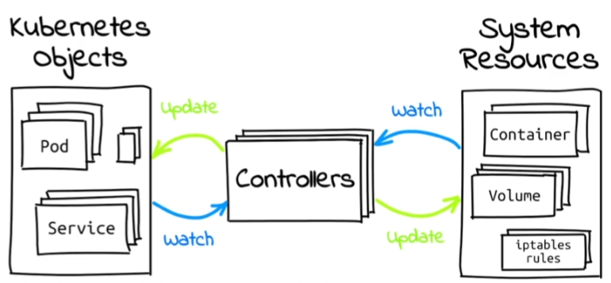

<!--more-->

# 명령형 vs 선언형
## 명령형 (imperative)
- 수행하고자 하는 액션을 지시
- 적은 리소스에 대해 빠르게 처리 가능
- 여러 명령어를 알아야 함

## 선언형 (declarative)
- 최신 트렌드
- 도달하고자 하는 상태(desired state)를 선언
- 코드로 관리 가능 (gitops 활용 가능)
    - 변경사항에 대한 감사(audit) 용이
    - 코드리뷰를 통한 협업
- 멱등성 보장(apply)
- 많은 리소스에 대해서도 매니페스트 관리 방법에 따라 빠르게 처리 가능
- 알아야 할 명령어 수가 적음

# 명령형 kubectl 명령어
```
kubectl create deployment grafana --image=grafana/grafana --port=3000
kubectl expose deployment grafana --type=NodePort --port=80 --target-port=3000

# Print grafana service url
minikube service grafana
```

# 선언형 kubectl 명령어

```
kubectl apply -f deployment.yaml
kubectl apply -f service.yaml

# Print grafana service url
minikube service grafana
```
