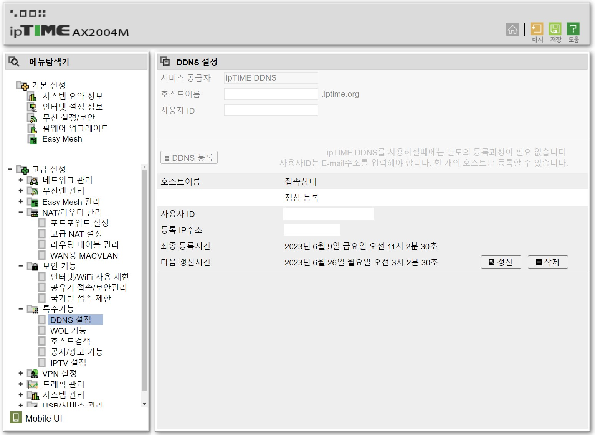
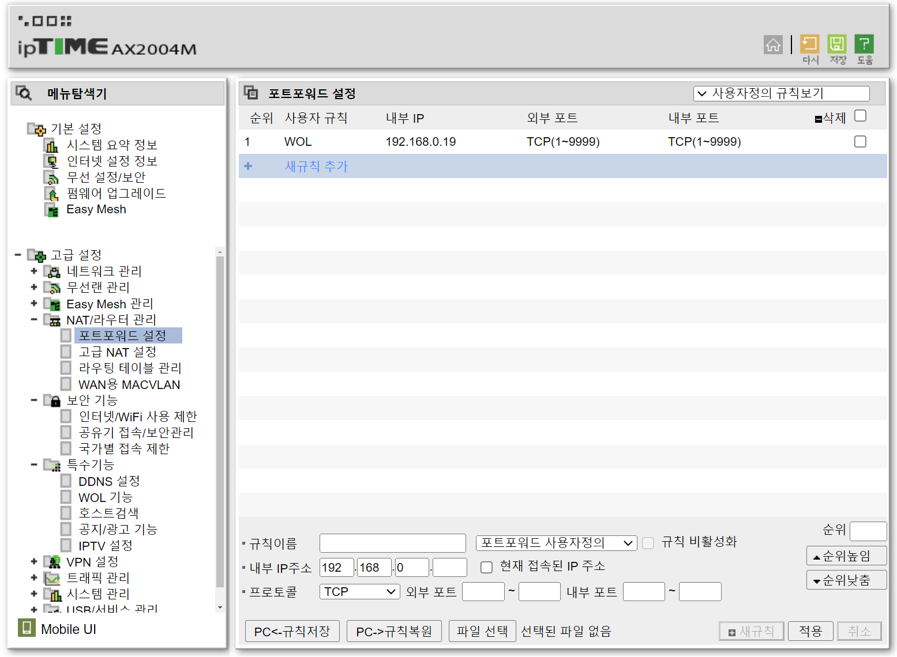
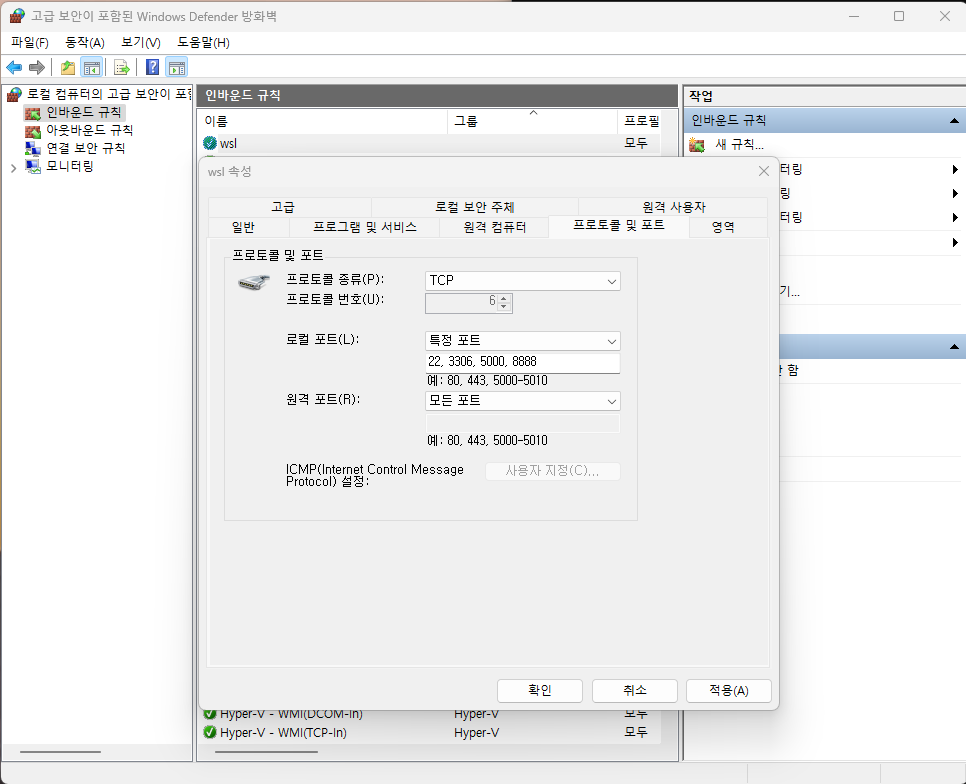

<!--more-->

외부에서 Windows 상에서 돌아가는 WSL2에 접속하려면 몇 가지 과정을 거쳐야한다. \
외부에서 공유기, Windows를 거쳐 WSL2에서 동작하는 프로세스에 접속할 수 있게 하는 설정에 대해서 알아보자.


# 1. 공유기 설정(ipTIME)
[192.168.0.1](192.168.0.1)

## 1.1 DDNS 설정
고정 IP를 사용하고 있지 않다면 DDNS를 등록하여 고정 IP 처럼 사용할 수 있다.



## 1.2 포트포워딩 설정



# 2. Windows 설정
## 2.1 포트포워딩 설정
1. 열고 싶은 포트를 변경한 후, 파일로 저장 (`port_forwarding.ps1`)
    ```
    If (-NOT ([Security.Principal.WindowsPrincipal][Security.Principal.WindowsIdentity]::GetCurrent()).IsInRole([Security.Principal.WindowsBuiltInRole] "Administrator"))

    {   
    $arguments = "& '" + $myinvocation.mycommand.definition + "'"
    Start-Process powershell -Verb runAs -ArgumentList $arguments
    Break
    }

    $remoteport = bash.exe -c "ifconfig eth0 | grep 'inet '"
    $found = $remoteport -match '\d{1,3}\.\d{1,3}\.\d{1,3}\.\d{1,3}';

    if( $found ){
    $remoteport = $matches[0];
    } else{
    echo "The Script Exited, the ip address of WSL 2 cannot be found";
    exit;
    }

    $ports=@(22, 3306);

    iex "netsh interface portproxy reset";
    for( $i = 0; $i -lt $ports.length; $i++ ){
    $port = $ports[$i];
    iex "netsh interface portproxy add v4tov4 listenport=$port connectport=$port connectaddress=$remoteport";
    }
    iex "netsh interface portproxy show v4tov4";
    ```
2. 관리자 권한으로 powershell을 실행시키고 저장한 파일을 실행
   ```
   $ PowerShell.exe -ExecutionPolicy Bypass -File .\port_forwarding.ps1
   ```

## 2.2 방화벽 설정
방화벽 고급설정의 인바운드 규칙에서 원하는 포트에 대한 방화벽 설정을 추가한다.




# 3. WSL2 설정
## 3.1 방화벽 설정
`ufw` 명령어를 통해 원하는 포트를 관리한다.
