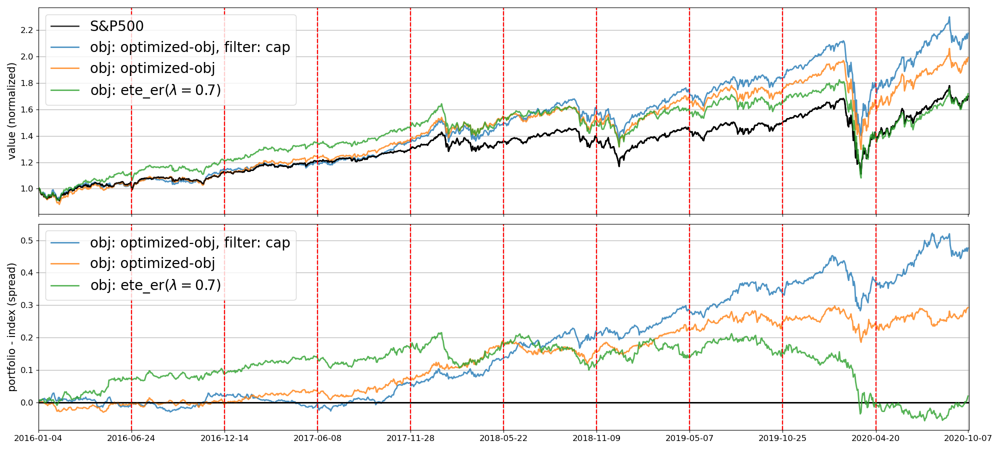

  
- Name: 윤동진(Dongjin Yoon)
- Email: djyoon0223@gmail.com
- Github: [https://github.com/alchemine](https://github.com/alchemine)
- Blog: [https://alchemine.github.io](https://alchemine.github.io)
- Docker Hub: [https://hub.docker.com/search?q=djyoon0223](https://hub.docker.com/search?q=djyoon0223)
- Skills
  - Python (TensorFlow, PyTorch, Scikit-learn, Matplotlib, Numba, CUDA, Dask), R, C/C++
  - Git, Docker, SQL Server, MySQL, Sphinx, Spotfire
  - Linear algebra, Mathematical statistics, Machine learning, Deep learning, Reinforcement learning, Refactoring, CUDA programming, Evolutionary algorithm, Financial engineering
- Interests
  - Statistics, Data visualization, Feature engineering, Refactoring, Code optimization, Parallel computing, Financial engineering
- Work Experience
  - ㈜큐헷지 (2020/04 ~ 2022/02)
    - AI Researcher
    - Enhanced index tracking algorithm
    - Multi-node, multi-GPU distributed/parallel computing
- Education
  - 인하대학교 컴퓨터공학과 학사 졸업 (2019/02)
  - 인하대학교 전기컴퓨터공학과 석사 졸업 (2022/02)
    - [윤동진, 이주홍, 최범기, 송재원, "부분복제 지수 상향 추종을 위한 진화 알고리즘 기반 3단계 포트폴리오 선택 앙상블 학습", 스마트미디어저널, 제10권, 제3호, 39-47쪽, 2021년 9월](https://kism.or.kr/file/memoir/10_3_4.pdf)
- 함께 열정을 불태울 동료를 찾고 있습니다.


---

# Projects
## 1. Pypi package: analysis-tools
데이터 분석에 필요한 다양한 도구들을 간편하게 사용할 수 있는 패키지

- [https://github.com/alchemine/analysis-tools](https://github.com/alchemine/analysis-tools)
- [https://pypi.org/project/analysis-tools](https://pypi.org/project/analysis-tools)


from analysis_tools import eda

eda.plot_features(data)
eda.plot_features_target(data, target)



---

## 2. 풍력 발전소 전기 에너지 발생량 예측 대회
풍속, 온도 등 풍력발전 터빈과 관련된 데이터를 이용하여 미래의 전기 에너지 발생량을 예측하는 프로젝트

- [https://github.com/Inha-Competition-Team/spatio-temporal](https://github.com/Inha-Competition-Team/spatio-temporal)

<details>
<summary><b> 1) Preprocessing </b></summary>
<div markdown="1">

- [https://github.com/Inha-Competition-Team/spatio-temporal/blob/main/%EC%B5%9C%EC%A2%85%EA%B2%B0%EA%B3%BC/source%20code/prepare_data.ipynb](https://github.com/Inha-Competition-Team/spatio-temporal/blob/main/%EC%B5%9C%EC%A2%85%EA%B2%B0%EA%B3%BC/source%20code/prepare_data.ipynb)

  ```
  1. 데이터 분할의 편의성을 위해 시간을 정수로 변환
      e.g. 1 day 00:00 -> 1
          1 day 00:10 -> 2
          1 day 00:20 -> 3
  2. 정해진 범위가 존재하는 feature들에 대한 데이터 처리
    1) 음수가 될 수 없는 feature(풍속 등): 0 이하의 값을 최소의 양수값으로 변환
    2) 정해진 범위를 벗어난 feature: 주어진 범위로 clipping
  3. 데이터를 보면서 크게 문제가 있는 부분을 직접 선택하여 Nan값으로 변환
  4. 시계열 데이터의 trend를 고려하여 이상치를 검출하고 Nan값으로 변환
  5. 실측값(Nan값)을 가까운 turbine들 중 가장 유사한 turbine의 값으로 채움
    1) 각 turbine들 간의 거리를 계산(euclidean distance)
    2) 각 turbine(기준 turbine)에 대하여 가까운 turbine들(이웃 turbine)을 MAE가 작은 순으로 정렬
    3) 정렬된 순서로 기준 turbine의 실측값을 이웃 turbine들의 값으로 채움
    4) 모든 turbine들에 대하여 위의 수행을 반복
  6. 여전히 남은 실측값은 각 turbine 별로 interpolation을 통해 채움
  7. 데이터와 관련된 다양한 feature들을 생성 및 추출(feature engineering)
  8. 가장 correlation이 높은 lag값을 선택하여 lagged, moving average feature를 생성
  9. MinMax Scaling
  ```
  
  1. Raw data
  
  2. Processed data
  

</div>
</details>

<details>
<summary><b> 2) Modeling & Prediction </b></summary>
<div markdown="1">

- [https://github.com/Inha-Competition-Team/spatio-temporal/blob/main/%EC%B5%9C%EC%A2%85%EA%B2%B0%EA%B3%BC/source%20code/main_transformer.ipynb](https://github.com/Inha-Competition-Team/spatio-temporal/blob/main/%EC%B5%9C%EC%A2%85%EA%B2%B0%EA%B3%BC/source%20code/main_transformer.ipynb)
- [Transformers for Time Series](https://github.com/maxjcohen/transformer)
  ```
  Transformer model을 사용
    f: Xy[t-i:t] -> y[t+1:t+j]
  ```
</div>
</details>

<details>
<summary><b> 3) Results </b></summary>
<div markdown="1">
1. Training set

2. Validation set

</div>
</details>

---

## 3. 부분복제 지수 상향 추종을 위한 진화 알고리즘 기반 3단계 포트폴리오 선택 앙상블 학습
부분복제 지수 상향 추종 알고리즘을 구현한 프로젝트

- [윤동진, 이주홍, 최범기, 송재원, "부분복제 지수 상향 추종을 위한 진화 알고리즘 기반 3단계 포트폴리오 선택 앙상블 학습", 스마트미디어저널, 제10권, 제3호, 39-47쪽, 2021년 9월](https://kism.or.kr/file/memoir/10_3_4.pdf)
- [https://github.com/alchemine/enhanced-index-tracking](https://github.com/alchemine/enhanced-index-tracking)

<details>
<summary><b> 3-stage Portfolio Selection Ensemble Learning </b></summary>
<div markdown="1">

1. **3단계 포트폴리오 선택 알고리즘**
2. **자산 선택(Asset Selection)** <br>
Monte-Carlo Genetic Algorithm을 이용하여 목적함수를 최적화시키는 종목들로 구성된 동일 가중치 포트폴리오를 다수 생성
3. **자본 할당(Capital Allocation)** <br>
Differential Evolution을 이용하여 목적함수를 최적화시키는 편입비율을 할당
4. **포트폴리오 필터링(Portfolio Filtering)** <br>
생성된 포트폴리오들 중 상위 포트폴리오들(목적함수 기준)에 대하여 필터링 조건(목적함수와 다른 지표)이 최적인 포트폴리오를 선택 <br>
적절한 필터링 조건은 일반화 성능을 높이는데 큰 역할을 한다
5. **앙상블 학습 알고리즘**
    1. **데이터 분할** <br>
    데이터를 여러 개의 학습(training) 데이터와 검증(validation) 데이터 쌍으로 분할
    2. **포트폴리오 선택** <br>
    각 데이터 쌍에 대하여, 여러 개의 목적함수 각각을 최적화시키는 포트폴리오를 선택 (3단계 포트폴리오 선택 알고리즘)
    3. **목적함수에 대한 가중치 계산** <br>
    각 목적함수 별로 검증 데이터에 대한 포트폴리오의 성과지표의 평균을 계산
    4. **최종 포트폴리오 선택** <br>
    계산된 지표의 평균을 각 목적함수의 가중치로 하여 가중평균된 포트폴리오를 최종 포트폴리오로 선택
6. **최종 결과** <br>
2016년~2020년 약 5년 간 S&P500과 비교하여 평균적으로 27% 높은 Sharpe ratio, 225% 높은 [VWR](https://www.crystalbull.com/sharpe-ratio-better-with-log-returns/)을 보여주었음
  
  
</div>
</details>


---

## 4. 분산/병렬 처리 시스템
Dask 기반 분산/병렬 처리를 편리하게 사용할 수 있도록 만든 프로젝트

- [https://github.com/alchemine/distributed_computing](https://github.com/alchemine/distributed_computing) \


---

## 5. Prepared CUDA based Image for Machine Learning Project
Machine learning을 위한 CUDA 기반 docker image

- [https://github.com/alchemine/base](https://github.com/alchemine/base)
- [https://hub.docker.com/repository/docker/djyoon0223/base](https://hub.docker.com/repository/docker/djyoon0223/base)
- **Tag**
  1. `djyoon0223/base:basic`
  2. `djyoon0223/base:caret`
     - `caret`: `basic` + `pycaret`
  3. `djyoon0223/base:tf_torch`
     - `tf_torch`: `basic` + `tensorflow` + `pytorch`
  4. `djyoon0223/base:full`
     - `caret`: `djyoon0223/base:caret`
     - `tf_torch`: `djyoon0223/base:tf_torch`


docker pull djyoon0223/base:basic
docker pull djyoon0223/base:caret
docker pull djyoon0223/base:tf_torch
docker pull djyoon0223/base:full


---

## 6. Trading system
Backtesting 가능한 algorithm trader 프로젝트

- [https://github.com/alchemine/trading-system](https://github.com/alchemine/trading-system)
